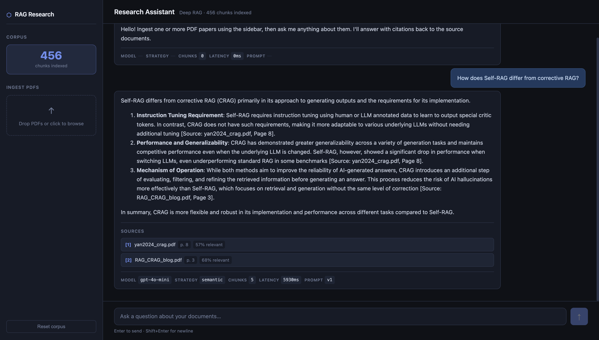

# Phase 4: Research Assistant — Deep RAG from First Principles  (In Progress)

A production-grade document research assistant built incrementally from naive RAG to multi-agent orchestration with LangGraph. Each part introduces new techniques, and every improvement is measured against a ground-truth evaluation dataset.

This project is part of the [Agentic AI Series](https://github.com/msdokania/agentic-ai-series).

---

## Motivation

Most RAG tutorials show how to chain together a vector store and an LLM. What practical applications don't show is: how to choose chunk sizes, why naive retrieval fails on multi-hop questions, how to measure if your system is actually grounded in evidence, or how to systematically improve quality through evaluation.

This project builds from a naive baseline, documenting exactly where and why it breaks, then fixes each failure mode with progressively better techniques. Every change is measured.

## Application screenshot



---

## Parts

### Part A — Naive RAG Baseline
Get the fundamentals working without any frameworks. Fixed-size chunking, basic semantic retrieval, simple prompt-based generation. Then systematically document where it fails and why.

### Part B — Advanced Retrieval
Fix each failure mode: smarter chunking strategies, hybrid search (semantic + BM25), cross-encoder re-ranking, and citation enforcement. Introduce LangChain for component swapping.

### Part C — Evaluation Framework
Build a rigorous evaluation pipeline using RAGAS against 50-200 ground-truth Q&A pairs. Measure retrieval precision, answer faithfulness, hallucination rate. Iterate prompts with data.

### Part D — Agent Orchestration
Wrap the pipeline in a multi-agent system with LangGraph. Router, Retriever, Synthesizer, Verifier, Reporter agents with conditional routing, retries, streaming, and production error handling.

---

## Quick Start

```bash
git clone https://github.com/msdokania/agentic-ai-series
cd agentic-ai-series/research-assistant-rag

# Create virtual environment
python -m venv venv
source venv/bin/activate  # or venv\Scripts\activate on Windows

# Install dependencies
pip install -r requirements.txt

# Start Chroma (vector store) — runs embedded, no Docker needed for Part A

# Set environment variables

# Ingest sample papers
python3 -m src.ingestion.ingest --input-dir data/papers/

# Run the API
uvicorn src.api.main:app --reload --port 8000

# Query
curl -X POST http://localhost:8000/query \
  -H "Content-Type: application/json" \
  -d '{"question": "What are the main approaches to retrieval-augmented generation?"}' | jq
```

---

## Stack

- **Python 3.11+**
- **Vector Store** — ChromaDB (embedded, no infrastructure needed)
- **Embeddings** — OpenAI `text-embedding-3-small`
- **LLM** — OpenAI `gpt-4o-mini` (dev), `gpt-4o` (eval)
- **PDF Extraction** — PyMuPDF (`fitz`)
- **Backend** — FastAPI
- **Frontend** — React + Vite (Part D)
- **Evaluation** — RAGAS
- **Orchestration** — LangGraph (Part D)

---

## Project Structure

```
04-research-assistant-rag/
├── README.md
├── requirements.txt
├── .env.example
├── prompts/
│   └── v1/
│       ├── config.yaml          # All prompts + parameters
│       └── changelog.md         # What changed and why
├── src/
│   ├── __init__.py
│   ├── ingestion/
│   │   ├── __init__.py
│   │   ├── pdf_extractor.py     # PDF → structured text
│   │   ├── chunker.py           # Text → chunks with metadata
│   │   ├── embedder.py          # Chunks → embeddings
│   │   ├── vectorstore.py       # ChromaDB operations
│   │   └── ingest.py            # CLI entry point
│   ├── retrieval/
│   │   ├── __init__.py
│   │   └── retriever.py         # Question → relevant chunks
│   ├── generation/
│   │   ├── __init__.py
│   │   ├── generator.py         # Chunks + question → answer
│   │   └── schemas.py           # Output data models
│   ├── config/
│   │   ├── __init__.py
│   │   ├── settings.py          # Environment config
│   │   └── prompt_loader.py     # Versioned prompt loading
│   └── api/
│       ├── __init__.py
│       ├── main.py              # FastAPI app
│       └── routes/
│           ├── __init__.py
│           ├── ingest.py        # Document upload endpoints
│           └── query.py         # Query endpoints
├── evaluation/
│   ├── ground_truth.yaml        # Q&A pairs (built in Part C)
│   └── reports/
│       └── part_a_failure_analysis.md
├── data/
│   └── papers/                  # Place PDF papers here
├── notebooks/
│   └── 01_chunking_exploration.ipynb
└── docs/
    └── architecture.md
```

# Architecture — Research Assistant RAG

## Part A: Naive Baseline

```
┌─────────────────────────────────────────────────────────────┐
│                      User Question                          │
└──────────────────────────┬──────────────────────────────────┘
                           │
                    ┌──────▼──────┐
                    │  FastAPI    │
                    │  /query     │
                    └──────┬──────┘
                           │
              ┌────────────▼────────────┐
              │      RETRIEVER          │
              │                         │
              │  1. Embed query         │
              │     (OpenAI embeddings) │
              │  2. Search ChromaDB     │
              │     (cosine similarity) │
              │  3. Return top-k chunks │
              │     with metadata       │
              └────────────┬────────────┘
                           │
              ┌────────────▼────────────┐
              │      GENERATOR          │
              │                         │
              │  1. Format context      │
              │     from chunks         │
              │  2. Fill prompt         │
              │     template (v1)       │
              │  3. Call LLM            │
              │     (GPT-4o-mini)       │
              │  4. Parse citations     │
              │  5. Build response      │
              └────────────┬────────────┘
                           │
              ┌────────────▼────────────┐
              │    QueryResponse        │
              │  - answer + citations   │
              │  - confidence           │
              │  - latency metrics      │
              │  - prompt version       │
              └─────────────────────────┘
```

## Ingestion Pipeline

```
PDF Files
    │
    ▼
┌──────────────┐     ┌──────────────┐     ┌──────────────┐     ┌──────────────┐
│ PDF Extractor│────▶│   Chunker    │────▶│   Embedder   │────▶│ Vector Store │
│              │     │              │     │              │     │  (ChromaDB)  │
│ PyMuPDF      │     │ Fixed-size   │     │ OpenAI       │     │              │
│ Page-level   │     │ token-based  │     │ text-embed-  │     │ Cosine       │
│ extraction   │     │ with overlap │     │ 3-small      │     │ similarity   │
└──────────────┘     └──────────────┘     └──────────────┘     └──────────────┘
                     
Each chunk carries metadata:
  - source_file (for citations)
  - page_numbers (for citations)
  - chunk_index (for ordering)
  - token_count (for context window budgeting)
```

## Prompt Versioning

```
prompts/
├── v1/
│   ├── config.yaml      ← All prompts + parameters
│   └── changelog.md     ← What changed and why
├── v2/
│   ├── config.yaml      ← Improved based on Part A failures
│   └── changelog.md
└── v3/
    ├── config.yaml      ← Improved based on RAGAS evaluation
    └── changelog.md

Every query response includes prompt_version,
making evaluation results fully reproducible.
```

## Data Flow for a Single Query

```
1. User asks: "What are the main approaches to RAG?"
2. API receives POST /query { question: "..." }
3. Retriever:
   a. Embeds question → [0.012, -0.034, 0.056, ...]
   b. Queries ChromaDB → top-5 chunks with scores
   c. Returns RetrievalResult with formatted context
4. Generator:
   a. Loads prompt config v1
   b. Fills template: system_prompt + context + question
   c. Calls GPT-4o-mini
   d. Parses [Source: file, Page X] citations from response
   e. Returns QueryResponse
5. API returns JSON with answer, citations, latencies, prompt version
```

## Key Design Decisions

**ChromaDB over Qdrant**: Runs embedded (no Docker), simpler setup for
a learning project. Qdrant would be better at production scale.

**Token-based chunking**: LLM context windows are measured in tokens.
Token-based chunks give predictable context window consumption.

**Page-level extraction**: Preserves the page → text mapping needed
for accurate citations. Many RAG systems lose this during extraction.

**Prompt versioning in YAML**: Every parameter that affects output
quality is in a single versioned file. No magic strings in code.

**Structured QueryResponse**: Machine-readable output enables
programmatic evaluation (Part C) and clean API responses.


<!-- ========================================================================= -->


# Data Directory

Place your PDF research papers in the `papers/` subdirectory.

## Recommended Corpus

For this project, use a collection of 10-15 AI/ML research papers on a focused topic.
A good starting point is RAG-related papers:

1. **"Retrieval-Augmented Generation for Knowledge-Intensive NLP Tasks"** — Lewis et al., 2020 (the original RAG paper)
2. **"Self-RAG: Learning to Retrieve, Generate, and Critique"** — Asai et al., 2023
3. **"Dense Passage Retrieval for Open-Domain Question Answering"** — Karpathy et al., 2020
4. **"RAPTOR: Recursive Abstractive Processing for Tree-Organized Retrieval"** — Sarthi et al., 2024
5. **"Lost in the Middle"** — Liu et al., 2023 (positional bias in long contexts)
6. **"Corrective RAG"** — Yan et al., 2024
7. **"Adaptive RAG"** — Jeong et al., 2024
8. **"HyDE: Hypothetical Document Embeddings"** — Gao et al., 2022
9. **"ColBERT: Efficient and Effective Passage Search"** — Khattab & Zaharia, 2020
10. **"From Local to Global: A Graph RAG Approach"** — Microsoft Research, 2024

Download these from arXiv or Semantic Scholar and place the PDFs here.

## Directory structure

```
data/
└── papers/
    ├── lewis2020_rag.pdf
    ├── asai2023_self_rag.pdf
    ├── ...
    └── README.md (this file — will not be ingested)
```

## Ingestion

```bash
python3 -m src.ingestion.ingest --input-dir data/papers/
```

<!-- ========================================================================= -->

# Part A — Failure Analysis Report

> **Prompt Version:** v1  
> **Date:** _(fill after running)_  
> **Corpus:** _(describe papers used)_  
> **Chunks:** _(count)_ chunks, size=500, overlap=50  

---

## Purpose

This report documents where the naive RAG baseline (Part A) fails and why.
These failures motivate the improvements in Part B.

---

## Test Questions & Results

### Category 1: Simple Factual (answer in one chunk)

| # | Question | Expected Answer | Actual Answer | Correct? | Notes |
|---|----------|-----------------|---------------|----------|-------|
| 1 | | | | ✅/❌ | |
| 2 | | | | ✅/❌ | |
| 3 | | | | ✅/❌ | |

**Observations:**
_(How did the system perform on straightforward lookups?)_

---

### Category 2: Multi-hop (answer spans multiple chunks)

| # | Question | Expected Answer | Actual Answer | Correct? | Notes |
|---|----------|-----------------|---------------|----------|-------|
| 4 | | | | ✅/❌ | |
| 5 | | | | ✅/❌ | |
| 6 | | | | ✅/❌ | |

**Observations:**
_(Did retrieval fetch all the needed chunks? Did the LLM connect information across them?)_

---

### Category 3: Tables & Structured Data

| # | Question | Expected Answer | Actual Answer | Correct? | Notes |
|---|----------|-----------------|---------------|----------|-------|
| 7 | | | | ✅/❌ | |
| 8 | | | | ✅/❌ | |

**Observations:**
_(Did fixed-size chunking break table structure? Could the LLM still extract the right data?)_

---

### Category 4: Reasoning / Synthesis

| # | Question | Expected Answer | Actual Answer | Correct? | Notes |
|---|----------|-----------------|---------------|----------|-------|
| 9  | | | | ✅/❌ | |
| 10 | | | | ✅/❌ | |

**Observations:**
_(For questions requiring comparison or inference — how did the system handle it?)_

---

### Category 5: Unanswerable (answer NOT in documents)

| # | Question | Expected Behavior | Actual Behavior | Correct? | Notes |
|---|----------|-------------------|-----------------|----------|-------|
| 11 | | Should refuse | | ✅/❌ | |
| 12 | | Should refuse | | ✅/❌ | |

**Observations:**
_(Did the system hallucinate or correctly admit insufficient context?)_

---

## Retrieval Analysis

| Question | Top chunk relevant? | Score | All needed chunks in top-5? | Notes |
|----------|--------------------:|------:|:---------------------------:|-------|
| Q1       |                     |       |                             |       |
| Q2       |                     |       |                             |       |

---

## Citation Analysis

| Question | Citations present? | Format consistent? | Citations accurate? |
|----------|:------------------:|:------------------:|:-------------------:|
| Q1       |                    |                    |                     |
| Q2       |                    |                    |                     |

---

## Summary of Failure Modes

### 1. Retrieval Failures
_(Chunks with the answer exist but weren't in the top-k)_

### 2. Chunking Failures  
_(Answer was split across chunk boundaries or table was broken)_

### 3. Generation Failures
_(Context was correct but LLM produced wrong answer or hallucinated)_

### 4. Citation Failures
_(Answer was correct but citations were missing, wrong, or inconsistent)_

### 5. Hallucination Cases
_(LLM generated confident but unsupported claims)_

---

## What Part B Should Fix

Based on these failures, the priorities for Part B are:

1. **_________________** — because _________________
2. **_________________** — because _________________
3. **_________________** — because _________________
4. **_________________** — because _________________